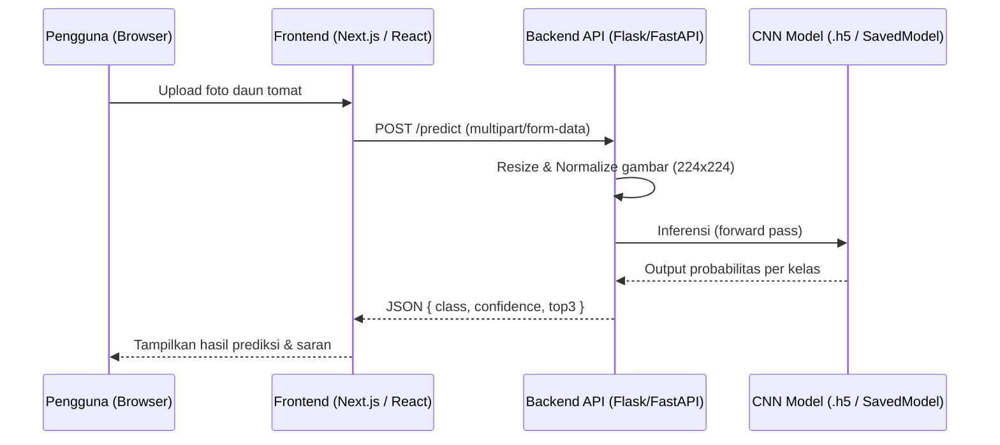

# PRD — Project Requirements Document

**TomatoGuard — Sistem Deteksi Penyakit Daun Tomat Berbasis Deep Learning**
*Versi 1.0 | April 2026*

---

## 1. Overview
Proyek ini bertujuan untuk membangun sistem berbasis web yang dapat mendeteksi penyakit pada daun tanaman tomat secara otomatis menggunakan model deep learning (Convolutional Neural Network). Masalah utama yang ingin diselesaikan adalah sulitnya petani atau pengguna awam mengenali jenis penyakit daun tomat secara cepat dan akurat tanpa membutuhkan keahlian agronomis.

Model dilatih secara lokal menggunakan dataset publik dari Kaggle (PlantVillage Dataset) yang mencakup berbagai kelas penyakit daun tomat. Setelah model siap, sistem akan disajikan dalam bentuk aplikasi web sederhana di mana pengguna dapat mengunggah foto daun tomat dan mendapatkan hasil prediksi beserta tingkat kepercayaan (confidence score) secara real-time.

Tujuan utama adalah menyediakan alat bantu diagnosis penyakit tanaman yang mudah diakses, akurat, dan tidak memerlukan koneksi internet setelah deployment (opsional offline mode).

## 2. Requirements
Berikut adalah persyaratan tingkat tinggi untuk pengembangan sistem:
- **Aksesibilitas:** Aplikasi dapat diakses melalui Web Browser (desktop/mobile).
- **Pengguna:** Sistem ditujukan untuk pengguna umum (petani, peneliti, mahasiswa) tanpa perlu login untuk fitur deteksi dasar.
- **Input Data:** Pengguna mengunggah gambar daun tomat (format JPG/PNG, maks. 5MB).
- **Model AI:** Model CNN dilatih lokal di laptop menggunakan dataset PlantVillage dari Kaggle.
- **Output Prediksi:** Sistem menampilkan nama penyakit, confidence score, dan deskripsi singkat beserta saran penanganan.
- **Dataset:** Menggunakan PlantVillage Dataset dari Kaggle yang mencakup 10 kelas penyakit dan 1 kelas daun sehat.
- **Performa Model:** Target akurasi minimal 85% pada data validasi.

## 3. Core Features
Fitur-fitur kunci yang harus ada dalam versi pertama (MVP):

### 3.1 Halaman Deteksi Penyakit (Fitur Utama)
- Upload gambar daun tomat via drag-and-drop atau file picker.
- Preview gambar sebelum dianalisis.
- Tombol **Analisis** untuk mengirim gambar ke backend model.
- Tampilan hasil prediksi: nama penyakit, *confidence score* (%), dan top-3 prediksi alternatif.
- Deskripsi penyakit dan rekomendasi penanganan singkat.

### 3.2 Halaman Informasi Penyakit (Disease Catalog)
- Daftar semua kelas penyakit yang bisa dideteksi oleh model.
- Setiap entri berisi: nama penyakit, gejala, penyebab, dan cara penanganan.
- Contoh gambar referensi untuk tiap penyakit.

### 3.3 Riwayat Deteksi (History)
- Menyimpan riwayat prediksi sesi terakhir (disimpan di `localStorage` browser).
- Pengguna dapat melihat kembali hasil deteksi sebelumnya dalam satu sesi.

### 3.4 Pipeline Training Model (Offline / Lokal)
- Script Python untuk download dan preprocessing dataset Kaggle (PlantVillage).
- Script training model CNN (TensorFlow/Keras) dengan konfigurasi epoch, batch size, dan learning rate yang dapat dikustomisasi.
- Export model ke format `.h5` dan TensorFlow SavedModel untuk deployment.
- Laporan hasil training: akurasi, *loss curve*, dan *confusion matrix*.

## 4. User Flow
Alur kerja sederhana bagi pengguna saat menggunakan aplikasi:

1. **Buka Aplikasi:** Pengguna membuka aplikasi web di browser.
2. **Upload Gambar:** Pengguna mengklik area upload atau drag-and-drop foto daun tomat yang ingin dianalisis.
3. **Preview & Analisis:** Gambar ditampilkan sebagai preview, lalu pengguna menekan tombol "Analisis Sekarang".
4. **Proses Inferensi:** Sistem mengirim gambar ke backend Flask/FastAPI, model CNN melakukan prediksi.
5. **Tampil Hasil:** Hasil prediksi tampil dalam hitungan detik — nama penyakit, confidence score, dan saran penanganan.
6. **Eksplorasi Lanjut:** Pengguna dapat mengklik nama penyakit untuk melihat detail di halaman *Disease Catalog*.
7. **Riwayat:** Hasil deteksi otomatis tersimpan di riwayat sesi untuk referensi.

## 5. Architecture
Berikut adalah gambaran arsitektur sistem dan aliran data dari input gambar hingga output prediksi:

**Alur Inferensi (Prediksi Gambar):**

## 6. Dataset & Model
### 6.1 Dataset
- **Sumber:** Kaggle — PlantVillage Dataset
- **Link:** https://www.kaggle.com/datasets/emmarex/plantdisease
- **Total Gambar:** ± 18.000 gambar daun tomat (RGB)
- **Split Data:** Train 70% | Validasi 15% | Test 15%

**Kelas yang dideteksi (11 kelas):**

| No. | Nama Kelas | Keterangan |
|---|---|---|
| 1 | Bacterial Spot | Bercak bakteri pada daun |
| 2 | Early Blight | Hawar daun awal (Alternaria) |
| 3 | Late Blight | Hawar daun lanjut (Phytophthora) |
| 4 | Leaf Mold | Jamur daun (Fulvia fulva) |
| 5 | Septoria Leaf Spot | Bercak daun Septoria |
| 6 | Spider Mites | Serangan tungau laba-laba |
| 7 | Target Spot | Bercak target (Corynespora) |
| 8 | Tomato Yellow Leaf Curl Virus | Virus keriting daun kuning |
| 9 | Tomato Mosaic Virus | Virus mosaik tomat |
| 10 | Healthy | Daun sehat (tidak terinfeksi) |

### 6.2 Arsitektur Model
- **Base Model:** MobileNetV2 atau EfficientNetB0 (pretrained ImageNet) — dipilih karena ringan dan cocok untuk training di laptop.
- **Transfer Learning:** Fine-tuning layer atas dengan data PlantVillage.
- **Input Size:** 224 x 224 x 3 (RGB).
- **Output Layer:** Softmax dengan 11 neuron (11 kelas).
- **Optimizer:** Adam dengan learning rate 0.0001.
- **Loss Function:** Categorical Crossentropy.
- **Target Akurasi Validasi:** ≥ 85%.

### 6.3 Training Environment

| Komponen | Spesifikasi |
|---|---|
| Platform | Laptop lokal (Windows/macOS/Linux) |
| Framework | TensorFlow 2.x / Keras |
| Akselerasi | GPU (NVIDIA CUDA) jika tersedia, fallback ke CPU |
| Manajemen Env | Conda atau venv Python 3.9+ |
| Dataset Tool | Kaggle API (`kaggle datasets download`) |
| Monitoring | TensorBoard (loss & accuracy curve) |

## 7. Design & Technical Constraints
Bagian ini mengatur batasan teknis dan panduan desain yang harus dipatuhi:

1. **High-Level Technology Stack:**
   - **Frontend:** Next.js (React) atau HTML/CSS/JS vanilla untuk UI yang ringan. 
   - **Backend API:** Flask atau FastAPI (Python) sebagai wrapper inferensi model.
   - **Model Format:** TensorFlow SavedModel atau `.h5` untuk kemudahan loading.
   - **Deployment Lokal:** Backend dijalankan di localhost, frontend di-serve oleh Node.js atau Nginx.

2. **Batasan Input Gambar:**
   - Format yang diterima: JPG, JPEG, PNG.
   - Ukuran maksimal file: 5 MB.
   - Resolusi gambar akan di-resize otomatis ke 224x224 oleh backend.

3. **Performa & Latensi:**
   - Waktu inferensi per gambar tidak boleh melebihi 5 detik pada CPU standar.
   - Backend harus memberikan respons JSON dalam waktu < 10 detik end-to-end.

4. **Typography Rules:**
   - Sans: Geist Mono, ui-monospace, monospace
   - Serif: serif
   - Mono: JetBrains Mono, monospace

5. **Keterbatasan Sistem:**
   - Model hanya mendeteksi penyakit daun tomat, bukan penyakit pada tanaman lain.
   - Input gambar harus berupa foto daun yang jelas; gambar blur atau gelap dapat menghasilkan prediksi tidak akurat.
   - Sistem tidak menyimpan data gambar pengguna ke server (privacy-first).

---

## 8. Future Enhancements (Roadmap)
Beberapa fitur yang dapat dipertimbangkan untuk pengembangan selanjutnya setelah MVP (Minimum Viable Product) selesai:
- **Dukungan Multi-Bahasa**: Menyediakan antarmuka dan deskripsi penyakit dalam bahasa daerah (misalnya Jawa, Sunda) selain Bahasa Indonesia agar lebih mudah dipahami oleh petani lokal.
- **Integrasi Cuaca (API)**: Menampilkan korelasi antara kondisi cuaca terkini di lokasi pengguna dengan potensi mewabahnya penyakit tertentu (contoh: kelembaban tinggi memicu jamur).
- **Sistem Pelaporan**: Fitur bagi pengguna untuk menyimpan hasil diagnosis dalam bentuk file PDF untuk dicetak atau dibagikan ke penyuluh pertanian.
- **Feedback Loop Model**: Memberikan opsi bagi pengguna ahli untuk mengoreksi hasil prediksi jika salah, di mana gambar tersebut akan digunakan untuk fine-tuning model di waktu mendatang (opsi opt-in).
- **Mobile App Native**: Pengembangan aplikasi dalam bentuk Android APK dengan dukungan TensorFlow Lite sehingga deteksi dapat dilakukan sepenuhnya secara *offline* di smartphone.
